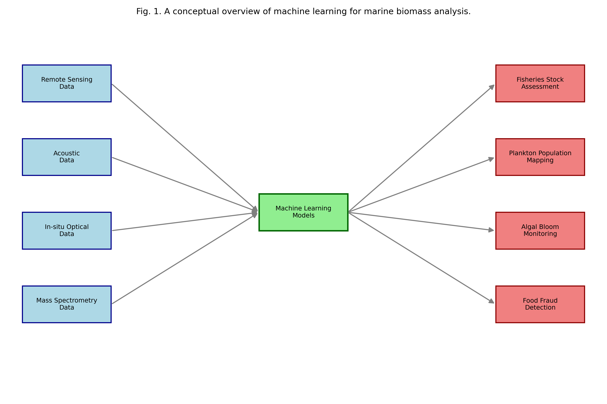
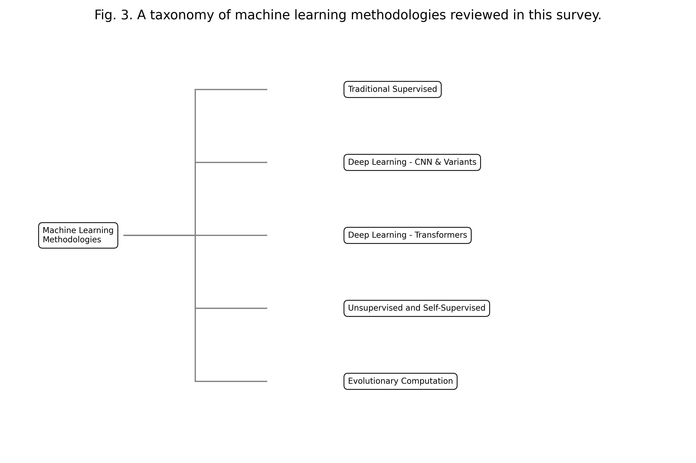

# Survey on Machine Learning for Marine Biomass Analysis

**Authors:** Jesse Wood, Bach Nguyen, Bing Xue, Mengjie Zhang, Daniel Killeen

> This manuscript was submitted on the 27th of October 2025. This work was supported by the MBIE Fund on Research Program under contract C11X2001.
>
> J. Wood, B. Nguyen, B. Xue, M. Zhang are associated with the Center for Data Science and Artificial Intelligence (CDSAI) at Victoria University of Wellington, Kelburn Parade, Wellington, 6012, New Zealand
>
> D. Killeen is associated with the Seafood Technologies department of Plant and Food Research New Zealand, Akerston Street, Nelson, 7010, New Zealand

---

## Abstract

This survey reviews recent advancements (2020-2025) in the application of machine learning (ML) and deep learning (DL) for the analysis and estimation of marine biomass. Traditional methods for biomass assessment are often costly, time-consuming, and spatially limited. ML offers powerful tools to process vast and complex datasets from diverse sources, including acoustic, optical, and environmental sensors. This review outlines the primary data modalities, explores the key ML methodologies being deployed (from supervised regression models to advanced deep learning architectures like CNNs and Transformers), and categorizes recent literature by major application areas. Key applications include automated fisheries stock assessment, high-throughput plankton classification, and large-scale phytoplankton biomass estimation from satellite imagery. We conclude by discussing persistent challenges, such as the need for robust ground-truth data, and highlight future trends, including data fusion and real-time, edge-computing models for autonomous marine systems.

## Impact Statement

Accurate marine biomass estimation is vital for sustainable fisheries and ecosystem monitoring, yet traditional survey methods are often slow, costly, and invasive. This article presents the first comprehensive survey of machine learning (ML) and deep learning (DL) applications that directly address these challenges. By synthesizing recent breakthroughs in analyzing complex acoustic, optical, and environmental data, this work provides a critical roadmap for engineers, data scientists, and marine biologists. It highlights how AI-driven automation enables faster, non-invasive, and more scalable biomass assessments, paving the way for improved real-time ocean resource management and a deeper understanding of marine ecosystem dynamics.

**Keywords:** *Machine Learning, Deep Learning, Marine Biomass Estimation, Fisheries, Acoustics, Plankton Classification, Ocean Remote Sensing, Literature Survey, Computer Vision*

---

## Introduction

Accurate monitoring of marine biomass is a cornerstone of sustainable ocean management and understanding global carbon cycles. However, traditional assessment methods face significant challenges in scale, cost, and timeliness, creating a critical gap where modern computational approaches can provide value. This introduction first establishes the significance of marine biomass, then outlines the limitations of traditional assessment methods. Finally, it introduces the role of machine learning (ML) as a powerful solution and defines the scope and objectives of this survey.

### Significance of Marine Biomass
(Discuss the critical role of marine biomass in global carbon cycles, ecosystem health, and as a resource for the blue economy. Emphasize the need for accurate and timely monitoring.)

### Challenges in Traditional Biomass Assessment
(Cover the limitations of methods like net trawls (destructive, low resolution), manual acoustic echogram analysis (time-intensive, subjective [brautaset2025]), and manual microscopy for plankton (slow [wisnu2024]).)

### The Role of Machine learning
(Introduce ML as a solution to handle the high volume, velocity, and variety (e.g., sensor fusion) of modern oceanographic data. Highlight automation, pattern recognition, and predictive capabilities, as reviewed in [malde2022] for deep learning in marine ecology.)

### Scope and Objectives of this Survey
(Define the boundaries: focus on papers from 2020-2025 that explicitly apply ML/DL techniques to a marine biomass analysis task. State the aim: to synthesize recent trends, key methodologies, and major application areas. This overall workflow is illustrated conceptually in Fig. 1.)

---

## Data Sources for ML-based Analysis

![Examples of the four primary data modalities used for ML-based biomass analysis. (a) A synthetic acoustic echogram showing a fish school (bright patch) and the seabed (bottom). (b) A simulated remote sensing image of a phytoplankton bloom (chlorophyll-a concentration). (c) A conceptual in-situ optical image from an underwater camera, showing ML-detected bounding boxes (red) on fish. (d) A typical mass spectrum (chemical fingerprint) from a biological sample, showing relative intensity vs. mass/charge (m/z).](figures/data_modalities_figure.png)

To apply the machine learning solutions proposed in the introduction, a diverse range of oceanographic data is required, as these data are the raw inputs from which models learn. This section details the primary data modalities used for marine biomass analysis. Examples of these data types, from acoustic echograms to mass spectra, are shown in Fig. 2. We will cover acoustic data from sonar, optical data from satellites and cameras, environmental sensor data, and chemical data from mass spectrometry.

### Acoustic Data
(E.g., Echosounders, sonar. Data is often in the form of echograms or spectrograms, as seen in Fig. 2(a). Ideal for fish and zooplankton detection. ML is used to automate the classification of acoustic targets (e.g., specific fish species) from echogram data [brautaset2025].)

### Optical and Imaging Data

#### Satellite and Airborne Remote Sensing
(E.g., Ocean color data (MODIS, Sentinel) as a proxy for phytoplankton biomass (Chlorophyll-a), shown conceptually in Fig. 2(b). This is a well-established field with its own reviews [ditria2025]. Recent work has focused on using probabilistic ML models with hyperspectral data to improve phytoplankton abundance estimates [kwon2025].)

#### In-situ Cameras and Video
(E.g., Underwater video systems, towed camera sleds, benthic landers, as represented in Fig. 2(c). This is a major area of research in aquaculture for monitoring fish health and biomass [aftab2024], often requiring models that can handle occlusion [zhang2024]. It is also used for real-time catch analysis on fishing vessels [park2024] and for monitoring aquaculture infrastructure like mussel farm buoys, even in challenging low-light conditions [mcmillan2023improving, zhao2023buoy, mcmillan2024deep].)

### Environmental and Sensor Data
(E.g., Temperature, salinity, pH, nutrients. These features are often used in regression models to predict and optimize biomass production, particularly for microalgae [seto2025].)

### Mass Spectrometry and Chemical Data
(Introduce ambient mass spectrometry (AMS) techniques like Rapid Evaporative Ionization Mass Spectrometry (REIMS) [black2017real] and Gas Chromatography (GC) [wood2022automated] as data sources for rapid, molecular-level analysis. This data, which consists of high-dimensional spectral fingerprints (Fig. 2(d)), is ideal for ML classification and regression [wood2025hook, huang2025symbolically].)

---

## Machine Learning Methodologies

Once the varied data from these sources is collected, appropriate machine learning models must be selected to process it and extract meaningful patterns. This section provides a taxonomy of the key ML methodologies deployed in the recent literature. A hierarchical breakdown of this taxonomy is presented in Fig. 3. These include traditional supervised learning, deep learning architectures, unsupervised clustering, and interpretable methods like symbolic regression.

### Supervised Learning

#### Regression Models
(E.g., Random Forests (RF), Support Vector Regression (SVR), Gradient Boosting (XGBoost). Used to predict continuous biomass values from video, even with occlusion [zhang2024], or to predict related metrics like mussel farm buoy buoyancy [mcmillan2024deep]. Also used to optimize production based on environmental inputs [seto2025].)

#### Classification Models
(E.g., Support Vector Machines (SVM), Random Forests. These are often used as baseline models or in combination with other methods, such as in classifying mass spectra [wood2022automated].)

### Deep Learning

#### Convolutional Neural Networks (CNNs)
(The dominant model for image-based tasks. Used for: species identification from images [wisnu2024], semantic segmentation of echograms [brautaset2025], and object detection for aquaculture automation [mcmillan2023improving, zhao2023buoy].)

#### Advanced Architectures (e.g., YOLO, Transformers)
(E.g., YOLO (You Only Look Once) is heavily used for real-time object detection, such as for fish counting on vessels [park2024], phytoplankton identification [wisnu2024], and muscle float byouancy detection [zhao2023buoy,mcmillan2023improving,mcmillan2024deep]. Transformers, adapted from language processing, are now being used to classify complex, high-dimensional spectral data from mass spectrometry [wood2025hook].)

### Unsupervised Learning
(E.g., K-Means, DBSCAN. Used for clustering acoustic data into distinct signal types (e.g., "fish school," "seabed," "plankton layer") without pre-existing labels.)

### Evolutionary Computation and Symbolic Regression
(Discuss methods like Genetic Programming (GP) that evolve interpretable mathematical equations. This approach, part of the 'Evolutionary Computation' branch in Fig. 3, can discover novel relationships, such as finding formulas to predict fish biomass directly from spectral data, which contrasts with "black box" neural networks [huang2025symbolically].)

---

## Key Application Areas and Recent Literature

With an understanding of the available data (Section II) and the ML methodologies (Section III), we can now explore how researchers are combining them to solve real-world problems. This section surveys the key application areas where these techniques are having the most impact, summarized in Table 1. We will review recent literature in fisheries and aquaculture assessment, plankton analysis, large-scale phytoplankton monitoring, and molecular-level analysis for food authenticity.

| **Reference** | **Application Area** | **Data Source** | **ML Method(s)** | **Key Contribution** |
| --- | --- | --- | --- | --- |
| Malde et al. [malde2022] | Marine Ecology (General) | (Review) | Deep Learning | Overview of DL potential, applications, and outlook. |
| Brautaset et al. [brautaset2025] | Fisheries Assessment | Acoustic Echograms | ML / CNNs | Integrating ML acoustic classification into survey estimations.|
| Kwon et al. [kwon2025] | Phytoplankton Monitoring | Hyperspectral Remote Sensing | Probabilistic ML | Probabilistic estimation of phytoplankton abundance. |
| Ditria et al. [ditria2025] | Phytoplankton Monitoring | Ocean Color Remote Sensing | ML (Review) | A review of ML applications for ocean color data. |
| Zhang et al. [zhang2024] | Aquaculture / Fisheries | In-situ Video | Regression | A framework for fish biomass estimation from video with occlusions.|
| Wisnu Ardhi et al. [wisnu2024] | Plankton Analysis | In-situ Microscopy Images | YOLO | Enhanced YOLO model for automatic phytoplankton identification.|
| Seto et al. [seto2025] | Algal Biomass Monitoring | Environmental Sensor Data | ML (Optimization) | Optimizing environmental factors to influence algal biomass. |
| Park et al. [park2024] | Fisheries Management | Video / Sensor | AI / YOLO | A real-time, on-board AI system (AI-RCAS) for catch analysis. |
| Wood et al. [wood2025hook] | Food Authenticity | Mass Spectrometry (REIMS) | Transformers | Species and body part classification from complex spectral data.|
| Huang et al. [huang2025symbolically] | Food Authenticity | Mass Spectrometry (Spectral) | Genetic Programming | Discovering interpretable equations for biomass from spectra. |
| Aftab et al. [aftab2024] | Aquaculture | Video / Sensor | Cognitive Solutions (ML) | Biomass estimation and early disease detection in aquaculture. |
| Wood et al. [wood2022automated] | Food Authenticity | Gas Chromatography (GC) | Machine Learning | Automated fish classification from unprocessed GC data. |

### Fisheries and Aquaculture Assessment
(Using ML to count, classify, and measure fish to estimate stock biomass. This includes both wild fisheries assessment (e.g., acoustic classification [brautaset2025] and real-time catch monitoring [park2024]) and aquaculture applications. In aquaculture, ML is used for cognitive solutions to monitor biomass and health [aftab2024, zhang2024], as well as automating farm operations through infrastructure monitoring [mcmillan2023improving, zhao2023buoy, mcmillan2024deep].)

### Plankton and Zooplankton Analysis
(Automating the identification and counting of plankton from imaging systems (e.g., FlowCam, underwater microscopy). Deep learning models like YOLO have been customized to provide high-throughput, automated identification of phytoplankton [wisnu2024].)

### Phytoplankton and Algal Biomass Monitoring
(Using ML on satellite or hyperspectral remote sensing data to estimate chlorophyll-a concentrations or algal cell counts over large ocean areas [kwon2025]. This field is large enough to have its own recent reviews [ditria2025]. On a smaller scale, ML is also used to model and optimize the environmental factors for cultivated algal biomass production [seto2025].)

### Molecular-Level Analysis for Food Authenticity
(Using ML to analyze data from Mass Spectrometry (MS) and Gas Chromatography (GC), often for food fraud, provenance, and safety, which are proxies for biomass management [black2017real]. Deep learning models can classify species from raw GC data [wood2022automated] or REIMS spectra [wood2025hook]. Furthermore, symbolic regression can discover interpretable formulas to estimate biomass from this spectral data [huang2025symbolically].)

---

## Discussion: Gaps and Future Directions

While the applications reviewed in the previous section demonstrate significant progress, the field is not without its challenges, which in turn point toward new research avenues. This section discusses these critical gaps and highlights promising future directions. We first outline current challenges, such as the need for labeled data and model interpretability, and then explore future trends like sensor fusion and real-time edge computing.

### Current Challenges and Limitations
(E.g., The "labeled data bottleneck" for training deep learning models [malde2022]. Model interpretability (explainable AI); many DL models are "black boxes," which is a barrier to adoption. Methods that produce interpretable models, like symbolic regression, are one way to address this [huang2025symbolically]. Physical challenges like feature occlusion in underwater video [zhang2024] and the difficulty of ground-truthing remote sensing data [ditria2025] also remain.)

### Future Trends
(E.g., Sensor fusion (combining acoustic, optical, and chemical data [wood2025hook]) and real-time, on-board processing (edge computing) on AUVs/USVs [park2024], both of which are illustrated conceptually in Fig. 4. Physics-informed neural networks (PINNs) that incorporate oceanographic models also represent a key future direction.)

---

## Conclusion

After surveying the data, methodologies, applications, and future challenges of this domain, it is clear that machine learning is a transformative force in marine science. This concluding section summarizes the key findings of the review. It reiterates that ML is rapidly transitioning from a novel research tool to an essential and integral component of modern marine ecosystem monitoring.

## References

*   [aftab2024] Aftab, K., Tschirren, L., Pasini, B., & Zeller, P. (2024). "Intelligent Fisheries: Cognitive Solutions for Improving Aquaculture Commercial Efficiency Through Enhanced Biomass Estimation and Early Disease Detection". *Cognitive Computation*, 16(5).
*   [black2017real] Black, C., Chevallier, O. P., Haughey, S. A., Balog, J., Stead, S., Pringle, S. D., ... & Morris, M. (2017). "A real time metabolomic profiling approach to detecting fish fraud using rapid evaporative ionisation mass spectrometry". *Metabolomics*, 13(12), 153.
*   [brautaset2025] Brautaset, A., Johnsen, E., & Kvamme, C. (2025). "Integrating and assessing machine learning acoustic target classification models for fish survey estimations". *ICES Journal of Marine Science*, 82(5).
*   [huang2025symbolically] Huang, Z., Xue, B., Zhang, M., Ronney, J. S., Gordon, K. C., & Killeen, D. P. (2025). "Symbolically Regressing Fish Biomass Spectral Data: A Linear Genetic Programming Method with Tunable Primitives". *arXiv preprint arXiv:2505.21901*.
*   [kwon2025] Kwon, D. H., Ahn, J. M., Pyo, J. C., Lee, J., Abbas, A., Park, S., ... & Cho, K. H. (2025). "Probabilistic machine learning-based phytoplankton abundance using hyperspectral remote sensing". *GIScience & Remote Sensing*, 62(1), 2484864.
*   [ditria2025] Ditria, E. M., Lopez-Marcano, S., & Connolly, R. M. (2025). "A review of machine learning applications in ocean color remote sensing". *Remote Sensing*, 17(10), 1776.
*   [malde2022] Malde, K., Handegard, N. O., Eikvil, L., Salberg, A. B., Grimsby, J., Tran, A., ... & Joly, A. (2022). "Unlocking the potential of deep learning for marine ecology: overview, applications, and outlook". *ICES Journal of Marine Science*, 79(2), 319-338.
*   [mcmillan2023improving] McMillan, C., Zhao, J., Xue, B., Vennell, R., & Zhang, M. (2023). "Improving buoy detection with deep transfer learning for mussel farm automation". In *2023 38th International Conference on Image and Vision Computing New Zealand (IVCNZ)* (pp. 1-6). IEEE.
*   [mcmillan2024deep] McMillan, C., Zhao, J., Xue, B., Vennell, R., & Zhang, M. (2024). "Deep learning-based buoyancy prediction for intelligent mussel farm monitoring". In *2024 39th International Conference on Image and Vision Computing New Zealand (IVCNZ)* (pp. 1-6). IEEE.
*   [park2024] Park, J., Lee, S. W., & Kim, J. (2024). "{AI-RCAS}: A Real-Time Artificial Intelligence Analysis System for Sustainable Fisheries Management". *Sustainability*, 16(18), 8178.
*   [seto2025] Seto, M. A., Weatherhead, A., Gudo, M., Cave, R., Mackenzie, C., Martell, P., ... & McNeill, K. (2025). "Machine learning optimization of environmental factors influencing biomass and nutritional composition in local algal species". *bioRxiv*.
*   [wisnu2024] Wisnu Ardhi, O. D., Wibirama, S., Rochman, A., & Setiawan, R. D. (2024). "Enhanced you only look once approach for automatic phytoplankton identification". *IAES International Journal of Artificial Intelligence (IJ-AI)*, 13(4), 3426.
*   [wood2022automated] Wood, J., Nguyen, B. H., Xue, B., Zhang, M., & Killeen, D. (2022). "Automated fish classification using unprocessed fatty acid chromatographic data: a machine learning approach". In *Australasian Joint Conference on Artificial Intelligence* (pp. 516-529). Springer.
*   [wood2025hook] Wood, J., Nguyen, B., Xue, B., Zhang, M., & Killeen, D. (2025). "Hook, line, and spectra: machine learning for fish species identification and body part classification using rapid evaporative ionization mass spectrometry". *Intelligent Marine Technology and Systems*, 3(1), 16.
*   [zhang2024] Zhang, X., Yang, W., Liu, H., Fang, Y., Chen, C., & Yang, X. (2024). "Fish Biomass Estimation Under Occluded Features: A Framework Combining Imputation and Regression". *Journal of Marine Science and Engineering*, 10(7), 306.
*   [zhao2023buoy] Zhao, J., McMillan, C., Xue, B., Vennell, R., & Zhang, M. (2023). "Buoy detection under extreme low-light illumination for intelligent mussel farming". In *2023 38th International Conference on Image and Vision Computing New Zealand (IVCNZ)* (pp. 1-6). IEEE.